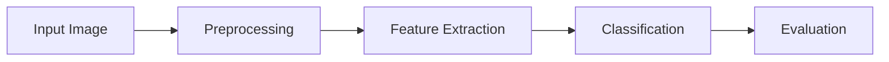

# System Architecture

## Pipeline Overview

The system follows a standard Computer Vision / Machine Learning pipeline:

## Detailed Components

### 1. Preprocessing
- **Input:** Raw RGB images from `DATASETS/DATASET 1`.
- **Resize:** All images are resized to a fixed resolution of **128x128 pixels** to ensure feature vector consistency.
- **Color Space Conversion:** Images are converted from **BGR to Grayscale**. Texture analysis using GLCM is strictly defined for single-channel intensity images.

### 2. Feature Extraction (GLCM)
We use the **Gray Level Co-occurrence Matrix (GLCM)** to describe the texture of the images.
- **Library:** `skimage.feature.graycomatrix`, `skimage.feature.graycoprops`.
- **Parameters:**
    - **Distances:** 1 pixel.
    - **Angles:** 0, 45, 90, 135 degrees (0, $\pi/4$, $\pi/2$, $3\pi/4$ radians).
    - **Levels:** 256 (standard 8-bit depth).
- **Features Extracted (6 per image):**
    1.  **Contrast:** Measures local variations in the GLCM.
    2.  **Dissimilarity:** Measure of how different the elements of the matrix are.
    3.  **Homogeneity:** Measures the closeness of the distribution of elements in the GLCM to the GLCM diagonal.
    4.  **Energy:** Sum of squared elements in the GLCM.
    5.  **Correlation:** Measures the joint probability occurrence of the specified pixel pairs.
    6.  **ASM (Angular Second Moment):** Measure of textural uniformity.
- **Aggregation:** The properties are calculated for each angle and then averaged to produce a rotation-invariant feature vector.

### 3. Classification (SVM)
- **Algorithm:** **Support Vector Machine (SVM)**.
- **Kernel:** **RBF (Radial Basis Function)**, suitable for non-linear data separation.
- **Scaling:** Data is normalized using `StandardScaler` (Zero Mean, Unit Variance) before feeding into the SVM, which is critical for distance-based algorithms like SVM.

### 4. Evaluation
- **Metrics:**
    - **Accuracy:** Overall correctness.
    - **Sensitivity (Recall):** Ability to correctly identify Malignant cases.
    - **Specificity:** Ability to correctly identify Benign cases.
- **Visualization:** Confusion Matrix heatmap.
